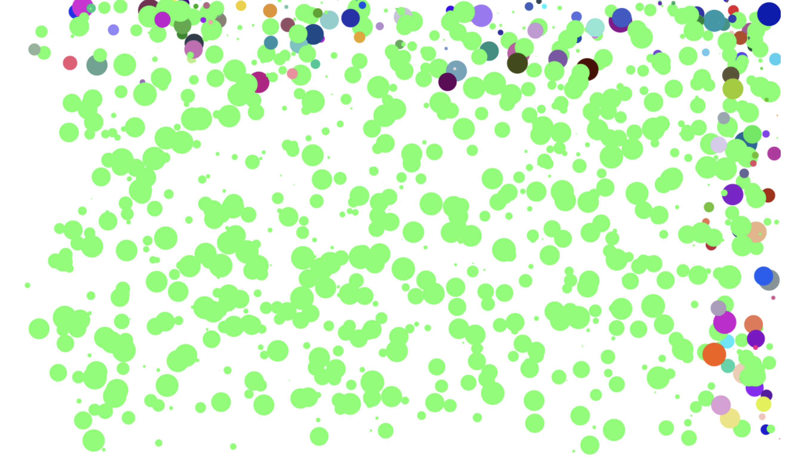
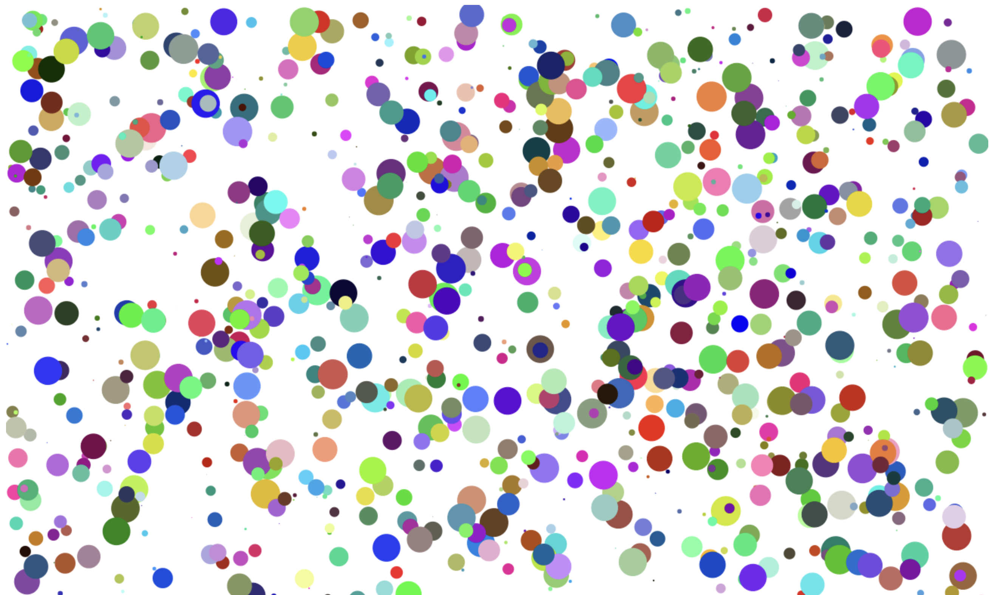

# [Perticles Animation](https://amoyr.github.io/random-partcles/)

# Background
I created animation for the first time. This is a one of what I wanna do with using js. I couldn't even use loop properly. From there, I learned function and class and so on. 

# How Animation
First, 1000 particles are created at a random position with having random velocity and particle size. Next, the particles start moving. If the particle hits a wall,  The particle changes random color and the vector inverses.

# Screenshot

